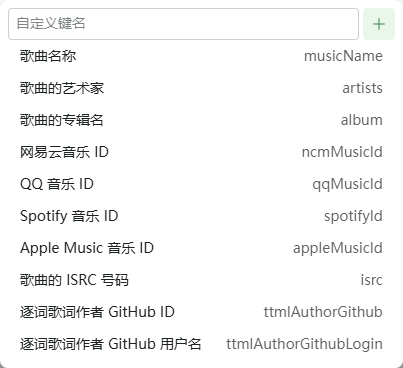
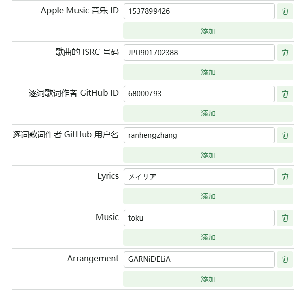
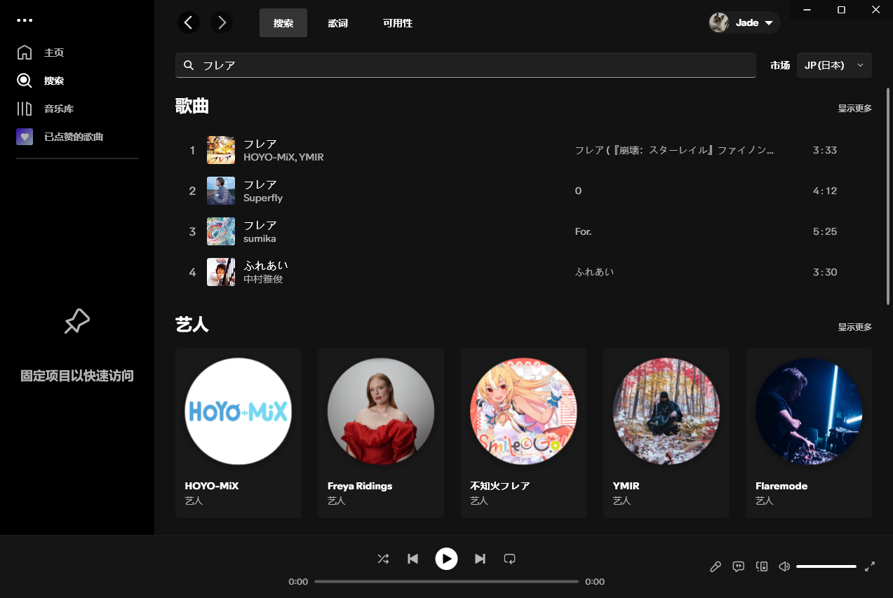

# 【非必要情况下不要在一个单词内添加多个文字】

# 【非必要情况下不要在一个单词内添加多个文字】

# 【非必要情况下不要在一个单词内添加多个文字】

###### 重要的事情先说三遍，不要问为什么

## 1. 元数据

> [!IMPORTANT]
>
> 请尽量使用 TTML TOOL 添加元数据，除非你已经阅读并充分理解了 TTML 文件的[具体格式规范](https://help.apple.com/itc/videoaudioassetguide/#/itc0f14fecdd)。

### 1.1 在 TTML TOOL 中

#### 1.1.1 填写方式

依次打开 <kbd>编辑</kbd> -> <kbd>编辑歌词元数据</kbd>，弹出以下界面：


预设的元数据的获取、添加参考[本篇文章](https://github.com/Steve-xmh/amll-ttml-tool/wiki/歌词元数据)。而对于不在预设中的元数据，可以通过在 <kbd>添加新键值</kbd> 菜单输入中「自定义键名」进行添加：



#### 1.1.2 填写标准

- 元数据的值应当**只有**对应平台的 ID 或对应个人/组合的名称
- 一个键能填写多个值，但是请勿重复填写相同的值
- 元数据应尽量做到**准确**、**全面**

<table border="1">
<tr>
      <td>✅</td>
      <td></td>
</tr>
<tr>
      <td>❌</td>
      <td></td>
</tr>
</table>


以下为节选自一份带有自定义元数据歌词在 TTML TOOL 中显示的样例：



### 1.2 在 TTML 文件中

> [!WARNING]
>
> 这部分不建议对于 TTML 文件格式不了解的人浏览，如果你只是一位打轴新手，或者并不关心文件代码中元数据的格式，查看上一章就足够填写标准了。

一个元数据在 TTML 文件按照以下格式存储：

```xml
<amll:meta key="artists" value="GARNiDELiA"/>
```

#### 1.2.1 关于 `key`

其中，有一些元数据的 `key` 是已经预设好的：

- `musicName` - 歌曲名称
- `artists` - 歌曲的艺术家
- `album` - 歌曲的专辑名
- `ncmMusicId` - 网易云音乐 ID
- `qqMusicId` - QQ 音乐 ID
- `spotifyId` - Spotify 音乐 ID
- `appleMusicId` - Apple Music 音乐 ID
- `isrc` - 歌曲的 ISRC 号码
- `ttmlAuthorGithub` - 逐词歌词作者 GitHub ID
- `ttmlAuthorGithubLogin` - 逐词歌词作者 GitHub 用户名

由于预设键将用于投稿时的解析以及审核，所以请严格按照预设填写 `key` 字段，对于非预设 `key` 则并没有额外要求。

#### 1.2.2 关于 `value`

- 元数据的值应当**只有**对应平台的 ID 或对应个人/组合的名称（即便是自定义 `key` 也请尽量遵守）
- 一个键能填写多个值，但是请勿重复填写内容相同的值
- 元数据应尽量做到**准确**、**全面**

<table border="1">
<tr>
      <td>✅</td>
      <td><code>&lt;amll:meta key="biliId" value="BV1QL4y1L7CP"/&gt;</code></td>
</tr>
<tr>
      <td>✅</td>
      <td><code>&lt;amll:meta key="演唱" value="メイリア"/&gt;</code></td>
</tr>
<tr>
      <td>❌</td>
      <td><code>&lt;amll:meta key="vocal" value="演唱：メイリア"/&gt;</code></td>
</tr>
</table>


## 2. 歌词正文

- 不得出现违反法律法规的内容；
- 不得包含歌词内容以外的信息，例如作词、作曲等信息应当放在元数据部分；
> [!WARNING]
> 
> 如表演者为团体，且需要注明每一句的具体演唱者时，可在翻译行的开头注明该句的演唱者；
- 不得包含 Emoji 或颜文字等无关内容；
  - 版权方提供的原始歌词文本中包含这些内容时除外；
- 内容真实、准确；
> [!WARNING]
> 
> 出自游戏、电影等其他作品中的专有名词须进行校对以保证准确性；
- 易混淆或易拼写错误的专有名词须注明出处以便考证；
- 歌词行的结尾不得使用句号或逗号，但可以按需使用感叹号、问号和引号； [[来源]](https://help.apple.com/itc/musicstyleguide/#/itc3ae5d4dea:~:text=歌词行的结尾不得使用句号或逗号，但可以按需使用感叹号、问号和引号。)
- 每行歌词都应遵循惯用的语法规则。 [[来源]](https://help.apple.com/itc/musicstyleguide/#/itc3ae5d4dea:~:text=和引号。-,每行歌词都应遵循惯用的语法规则。,-其他可在歌词)

---

### 2.1 英语限定

- 请遵循惯用的英文语法规则。专有名词必须首字母大写。此外，每行歌词中第一个单词必须首字母大写。
> [!TIP]
> 
> 有可信来源证明其原作者使用全大/小写文本的除外。
- 其他需要首字母大写的情况：
  - 与神和宗教相关的单词（宗教歌曲中的 God、You、Him、Your 等）
  - 缩略词大小写请遵循使用习惯（NASA、FBI 等）
  - 地理位置（East Coast、Southside 等）
  - 作品名称
  - 括号中第一个单词的首字母
  - 品牌名称

[[来源]](https://help.apple.com/itc/musicstyleguide/#/itc3ae5d4dea)

---

### 2.2 日语限定

- 尽可能在正文中使用方括号（「」『』）作为其他语言中的引号和单引号的代替；
- 不要把汉字对应的假名在文本中用括号列出来（包括<ruby>義訓<rt>ギクン</rt></ruby>）：

<table border="1">
<tr>
      <td>✅</td>
      <td>あの時こう……</td>
</tr>
<tr>
      <td>❌</td>
      <td>あの時（とき）こう…… </td>
</tr>
</table>

## 3. 翻译和音译

> [!WARNING]
> - 涉及政治敏感、有违人道主义的曲目不得提供歌词翻译；
>  - ❌ 如果为上述情况的国语歌曲则**不予提交歌词**；  
>   - 对于有可能 NSFW 的翻译，可以忠于原文，但请尽量注意尺度，否则可能因尺度过大不予通过；
>- 为避免可能的版权纠纷，使用 B站等视频平台中作品包含的原创翻译内容时，请标注来源；
- 不得出现违反法律法规及公序良俗的内容；
- 对于非国语歌词，请尽可能提供真实、准确的翻译和音译；
- 原则上禁止在翻译中插入 Emoji 或颜文字等无关内容，除非翻译作品的版权方也是这么做的；
- 原则上不建议在翻译行末尾保留逗号。


## 4. 排版

- 尽可能按照单个文字或单个音节制作逐字/逐音节歌词；
- 在机器人处理后的文件中，不允许出现空格包含在音节内**首尾**的情况；
- 不允许包含空白行；
- 按照各语言的书写习惯合理选择使用半角或全角标点符号；
- 在不影响时间轴精确度的情况下，可以将标点符号作为单独的单词打轴；
- 合理使用对唱/背景视图：
  - 背景人声的歌词应单独为一行，放在主唱人声歌词的下一行并标记为背景行；
    - （非强制要求）不应因背景行而延长主行时间轴的持续时间；
  - 如果不确定何时换行或分段，请参考以下划分依据： [[来源 1]](https://help.apple.com/itc/musicstyleguide/#/itc3ae5d4dea)[[来源 2]](https://help.apple.com/itc/musicstyleguide/#/itc3ae5d4dea)
    - Apple Music 所建议的组成部分
    
      > - Verse（主歌）
      > - Chorus（副歌）
      > - PreChorus（预副歌）
      > - Bridge（桥段）
      > - Intro（前奏）
      > - Outro（尾奏）
      > - Refrain（叠句）
      > - Instrumental（器乐）
      > - Hook（钩子）
    - 歌曲节拍速度发生变化
    - 艺人对歌词的演绎方式发生变化（例如，从歌唱切换成说唱）
- 一般不允许多行歌词的时间轴重叠，但在不影响歌词准确的情况下，下面这些情况是例外：
  - 对唱中两位或多位艺人进行合唱或重唱；
  - 上下文具有关联性，为了叙事或表达要求而特意设置的，例如**完整的一句被拆分为了语法缺失的两句**或**上下两句互文、对仗**；
  - 由于混音或编曲使两行歌词的时间轴有重叠部分。

> [!WARNING]
>
> 对于背景行，如果使用 TTML TOOL 进行歌词的制作，请不要在第一个音节的开头和最后一个音节的末尾添加括号，这是因为 TTML TOOL 会自行处理括号部分，如果再手动添加，则会导致歌词中出现多余括号。
>
> 例如以下背景行在 TTML TOOL 中显示为：
>
> > <kbd>In</kbd> <kbd>空格x1</kbd> <kbd>your</kbd> <kbd>空格x1</kbd> <kbd>heart</kbd>
>
> 那么导出时为：
>
> ```xml
> <span ttm:role="x-bg" begin="02:23.620" end="02:25.690"><span begin="02:23.620" end="02:24.100">(In</span> <span begin="02:24.100" end="02:24.380">your</span> <span begin="02:24.380" end="02:25.690">heart)</span></span>
> ```
>
> 但如果在 TTML TOOL 中手动再添加一次括号：
>
> > <kbd>(In</kbd> <kbd>空格x1</kbd> <kbd>your</kbd> <kbd>空格x1</kbd> <kbd>heart)</kbd>
>
> 那么导出时就会变为：
>
> ```xml
> <span ttm:role="x-bg" begin="02:23.620" end="02:25.690"><span begin="02:23.620" end="02:24.100">((In</span> <span begin="02:24.100" end="02:24.380">your</span> <span begin="02:24.380" end="02:25.690">heart))</span></span>
> ```
>
> 成为一种不合规的形式，将无法通过审核。

---

### 4.1 英语限定

- 不得将空格包含在单词首尾
- 不允许使用一个以上的空格来分隔单词

<table border="1">
<tr>
      <td>❌</td>
      <td><code>This \ is \a  \lyric</code></td>
</tr>
<tr>
      <td>❌</td>
      <td><code>This \is \a \lyric</code></td>
</tr>
<tr>
      <td>❌</td>
      <td><code>This\ is\ a\ lyric</code></td>
</tr>
<tr>
      <td>✅</td>
      <td><code>This\ \is\ \a\ \lyric</code></td>
</tr>
<tr>
      <td>✅</td>
      <td><code>Thi\s i\s a\ \ly\ri\c</code></td>
</tr>
</table>

## 5. HOYO-MiX

- 在以上要求的基础之上，要求将尽可能多地区的元数据添加到文件中；
  - 当前，Apple 和 Spotify 分为下面这些分区，请按照这些分区逐一查找并添加元数据：[参考](https://github.com/Steve-xmh/amll-ttml-db/issues/3366)
    - 简中区（Spotify 无简中区）；
    - 繁中区；
    - 韩语区；
    - 日语区；
    - 其它区（除了以上地区以外的其它地区，语言为英语）。
- 必须是逐字歌词（如果是英文则应当精细到音节）；
- 必须适配艺人演唱时的各类效果。

> **关于查找不同区的元数据**
>
> Apple Music 可以通过 AME 插件切换分区查找：
>
> 
>
> - 简中区：Chinese Mainland
> - 繁中区：Hong Kong SAR, Macao SAR, Taiwan Province, People's Republic of China
> - 韩语区：Korea, Republic of
> - 日语区：Japan
> - 其它区：United States、Russia、France、Vietnam、Brazil, etc.
>
> 但是这种方式只适用于**同一专辑在各个分区有着不同信息**的情况，而 HOYO-MiX 更倾向于在每个区发一份独占专辑，因此就需要访问各区的链接进行搜索：
>
> - 简中区：https://beta.music.apple.com/cn/search
> - 繁中区：https://beta.music.apple.com/hk/search （三选一即可）
> - &emsp;&emsp;&emsp;&emsp;https://beta.music.apple.com/mo/search （三选一即可）
> - &emsp;&emsp;&emsp;&emsp;https://beta.music.apple.com/tw/search （三选一即可）
> - 韩语区：https://beta.music.apple.com/kr/search
> - 日语区：https://beta.music.apple.com/jp/search
> - 其它区：https://beta.music.apple.com/us/search
>
> Spotify 可以使用 Lyricify 4 的搜索工具进行换区搜索：
>
> 

## 6. 其他

- 请善用结束时间来让歌词播放器自动生成间奏区域，不要为了演出效果强制改变为错误的时间轴，例如为了不触发间奏强行延后上一句结束时间和提早下一句开始时间或为了触发间奏强行提前上一行结束时间和延后下一句开始时间；
- 歌曲作者等信息请使用 AMLL TTML Tool 的元数据功能添加（包括但不限于预设的字段）；
- 提交时标题中的「歌词提交/修正」尽量根据实际提交内容改为「歌词修正」或「歌词提交」；
- 如果是对已有歌词的修正，请在补充说明处写明修改原因提供给审核核对，否则将被退回。
